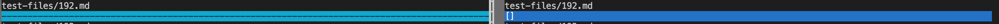
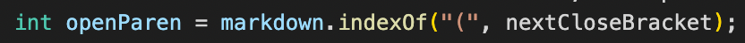
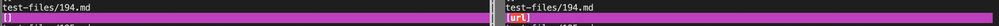
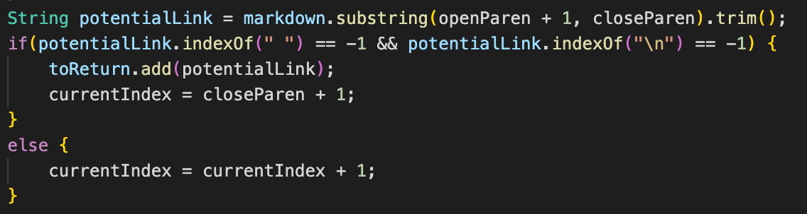

# Lab Report 5

#### How you found the tests with different results (Did you use vimdiff on the results of running a bash for loop? Did you search through manually? Did you use some other programmatic idea?)

> I used vimdiff to see the difference in results

---

#### Provide a link to the test-file with different-results (in the provided repository or your repository, either is fine)

> [test-file1](https://github.com/adrianmend25/5thLabReport/blob/main/192.md)

> [test-file2](https://github.com/adrianmend25/5thLabReport/blob/main/194.md)

---

### Test file 1 - 192.md
#### Expected Output:

#### Actual Output:

> Neither implementation is correct. It should return a link with the title "foo". Instead, mine doesn't even return an array while the other returns an empty array.

> The other implementation gives an error because it does not account for when no parenthesis is present. In that case it would just ignore it and not add it to the array as a link, but instead should just add the name of the link.

---
### Test file 2 - 194.md
#### Expected Output:

#### Actual Output:

> Neither implementation is correct. It should return a link with with title "Foo*bar]". Instead, mine returns an empty array while the other returns the url with the title "url".

> The other implementation returns the string for the url rather than the name that it should return. The link name is taken from the parenthesis rather than the brackets which is incorrect